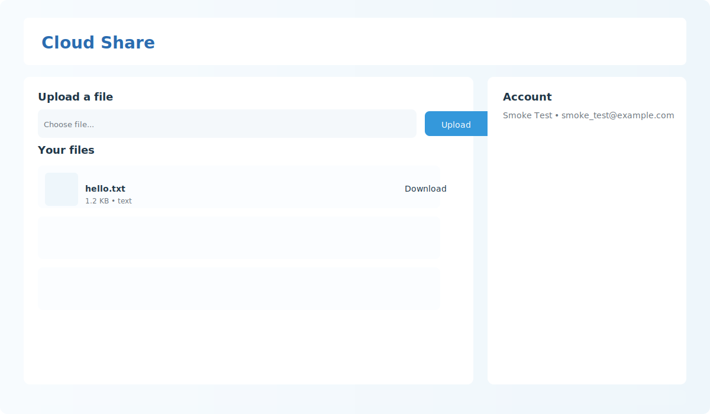

Project setup

Prerequisites
- Python 3.8+

Quick start (PowerShell)

```powershell
# create venv (optional but recommended)
python -m venv .venv
.\.venv\Scripts\Activate.ps1

# install dependencies
pip install -r requirements.txt

# create DB
python create_db.py

# run the app
python app.py

# open http://127.0.0.1:5000 in your browser
```

Notes
- The project reads `SECRET_KEY` from a `.env` file if present. A sample `.env` has been added.
- To register a user, visit `/register`. After login you can upload files from the dashboard.
Additional setup for GCS and email OTP

- Create a Google Cloud Storage bucket and set the `GCS_BUCKET` environment variable in `.env`.
- Provide credentials via `GOOGLE_APPLICATION_CREDENTIALS` pointing to your service account JSON, or configure ADC.
- Configure SMTP settings in `.env` (`SMTP_SERVER`, `SMTP_PORT`, `SMTP_USER`, `SMTP_PASSWORD`) so OTP emails can be sent on login.

If GCS is not configured the app will fallback to storing files in the local `uploads/` folder.

Security notes
- This demo uses simple OTP via email. For production, use a hardened email provider, rate-limiting, and consider TOTP (e.g., Google Authenticator) or SMS providers.

## Visuals

Included in the repository are a lightweight SVG logo and an SVG mockup screenshot of the updated UI. Use these assets in documentation or when presenting the project.

- Logo: `static/images/logo.svg`
- Screenshot (mockup): `static/images/screenshot.svg`

You can preview the screenshot by opening the SVG file in your browser, or include it in Markdown like this:



If you prefer a pixel PNG screenshot, start the app locally and capture `/dashboard` after logging in. Example using a headless Chromium (if available):

```powershell
# start the app in background
.venv\Scripts\python.exe app.py &
# capture with a headless browser (example for chromium)
#chromium --headless --disable-gpu --screenshot=dashboard.png --window-size=1200,800 "http://127.0.0.1:5000/"
```
